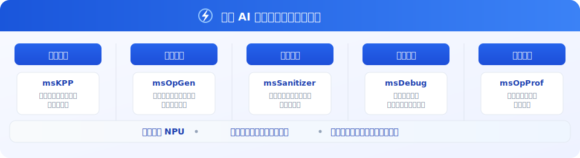

---
hide:
  - navigation
  - toc
---

# 算子工具全景

## 算子工具链

<!-- 

    

        

            

                
分析工具

                

                    

                        msprof-analyze
                    

                    

                        msAgent
                    

                

            

            

                
性能监控

                

                    

                        MindStudio Monitor
                    

                

            

            

                
AI框架

                

                    
PyTorch Profiler

                    
MindSpore Profiler

                

            

            

                
基础能力

                

                    
msProf

                    
MSTX

                    
MSPTI

                

            

        

        

            MindStudio Insight
        

        

            

            

        

    

 -->

<!--  -->

## TODO:工具总览和描述

## 相关入口

-   **[msOT](../msot/)**

    ---

    算子开发工具链，聚焦算子开发中的关键挑战。

-   **[msKPP](../mskpp/)**

    ---

    性能仿真工具，支持基于算子表达式快速预测其在给定算法实现下的性能上限。

-   **[msOpGen](../msopgen/)**

    ---

    算子工程自动生成工具，支持多种类型工程的快速构建。

-   **[msSanitizer](../mssanitizer/)**

    ---

    算子异常检测工具，提供内存越界、数据竞争、未初始化访问及同步异常四大检测能力。

-   **[msDebug](../msdebug/)**

    ---

    算子调试工具，用于调试在 NPU 侧运行的算子程序，为开发者提供关键调试能力。

-   **[msOpProf](../msopprof/)**

    ---

    算子调优工具，采集与分析运行在昇腾AI处理器上的算子关键性能指标，显著提升性能分析效率。

-   **[msOpTuner](../msoptuner/)**

    ---

    算子Tiling寻优工具，支持基于算子表达式快速预测其在给定算法实现下的性能上限。

-   **[msKL](../mskl/)**

    ---

    算子轻量化调用工具，支持在Python脚本中快速实现Kernel下发代码生成、编译及运行Kernel。

-   **[msOpCom](../msopcom/)**

    ---

    算子工具基础组件，提供算子工具运行所需的桩函数注入、接口劫持等功能。

-   **[msTX](../mstx/)**

    ---

    算子工具扩展接口库，自定义采集时间段或者关键函数的开始和结束时间点，识别关键函数或迭代等信息，对性能和算子问题快速定界。

